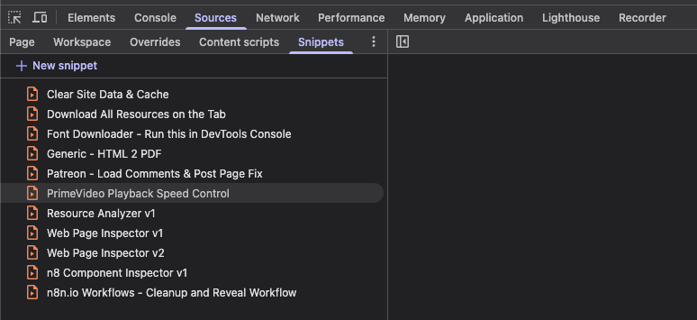

# DevTools Snippets

A collection of Chrome/Brave DevTools console snippets for web development, debugging, and page manipulation.

## Snippets

### General Purpose

| Snippet                               | Description                                                                                                                                                                                                                                                                |
| ------------------------------------- | -------------------------------------------------------------------------------------------------------------------------------------------------------------------------------------------------------------------------------------------------------------------------- |
| **Clear Site Data & Cache**           | Opens Brave's clear-browsing-data settings and optionally hard-reloads the page afterward.                                                                                                                                                                                 |
| **Download All Resources on the Tab** | Finds all `img`, `link`, `script`, `source`, and `iframe` elements on the page and triggers a download for each resource URL.                                                                                                                                              |
| **Font Downloader**                   | Fetches a Google Fonts CSS URL, extracts the font-file URLs, and prints ready-to-run `wget` and `curl` commands. Edit the `fontCssUrl` variable to target different fonts.                                                                                                 |
| **Generic - HTML 2 PDF**              | Converts the current page (or `#main-content` if present) to a PDF using [html2pdf.js](https://github.com/eKoopmans/html2pdf.js), with a date-stamped filename.                                                                                                            |
| **Resource Analyzer v1**              | Analyzes page resources (CSS, JS, fonts, images, SVGs, API calls) via the Performance API and DOM, then prints a grouped report in the console.                                                                                                                            |
| **Web Page Inspector v1 / v2**        | Comprehensive page analysis covering DOM structure, framework detection (React, Vue, Angular, Next.js, Nuxt, jQuery, Tailwind, etc.), web components, Shadow DOM, security headers, performance metrics, accessibility, and more. Results can be exported as JSON or HTML. |

### Site-Specific

| Snippet                                                     | Target Site      | Description                                                                                                                                                                                           |
| ----------------------------------------------------------- | ---------------- | ----------------------------------------------------------------------------------------------------------------------------------------------------------------------------------------------------- |
| **n8 Component Inspector v1**                               | n8n.io           | Inspects the `n8n-demo` custom element and its Shadow DOM. Uses MutationObservers to monitor attribute and child changes, auto-stopping after 30 seconds.                                             |
| **n8n.io Workflows - Cleanup and Reveal Workflow**          | n8n.io           | Makes embedded n8n workflows full-screen and interactive by removing overlays, headers, footers, and surrounding layout chrome. Survives SPA navigation.                                              |
| **Patreon - Load Comments & Post Page Fix**                 | Patreon          | Recursively loads all comments and replies, adjusts layout for readability, replaces YouTube embeds with thumbnails (CORS workaround), and generates a downloadable PDF of the post.                  |
| **PrimeVideo Playback Speed Control**                       | Prime Video      | Adds keyboard shortcuts (**D** = faster, **S** = slower) and a console helper `ss(rate)` to control video playback speed from 0.1x to 16x. Displays a brief on-screen overlay when the speed changes. |
| **Google AI Studio - DOM Inspector (library page)**         | Google AI Studio | Inspects the Library page DOM structure and downloads a `.txt` report of custom elements, list/grid containers, prompt-entry candidates, scrollable areas, and content-area tree dumps.               |
| **Google AI Studio - DOM Inspector (prompts page)**         | Google AI Studio | Dumps the full HTML tree of chat turns on a conversation page, showing how headings, lists, paragraphs, code blocks, and thought panels are nested.                                                   |
| **Google AI Studio - Chat Exporter (base64 attachments)**   | Google AI Studio | Exports a chat conversation to Markdown and/or JSON with per-turn scrolling for virtual scroll, thinking/reasoning blocks, and system instructions. Base64 images are kept inline.                    |
| **Google AI Studio - Chat Exporter (separate attachments)** | Google AI Studio | Exports a chat conversation to Markdown and/or JSON. Extracts embedded base64 images as separate downloadable files and references them by filename in the export.                                    |
| **Google AI Studio - Library Page Exporter**                | Google AI Studio | Exports all prompts/chats from the Library page to JSON, CSV, and/or Markdown. Scrolls the virtualized table to capture every entry.                                                                  |

## How to Use

### Option 1 -- DevTools Snippets Panel (recommended)

1. Open DevTools (`F12` or `Cmd+Opt+I` / `Ctrl+Shift+I`).
2. Go to **Sources** > **Snippets** (you may need to click the `>>` chevron to reveal the tab).
3. Click **+ New snippet**, give it a name, and paste the code.
4. Right-click the snippet and select **Run**, or press `Cmd+Enter` / `Ctrl+Enter`.

Snippets saved this way persist across browser sessions.

### Option 2 -- Console

1. Open DevTools and switch to the **Console** tab.
2. Paste the snippet code and press `Enter`.

## License

[MIT](LICENSE) -- CaptainCodeAU
