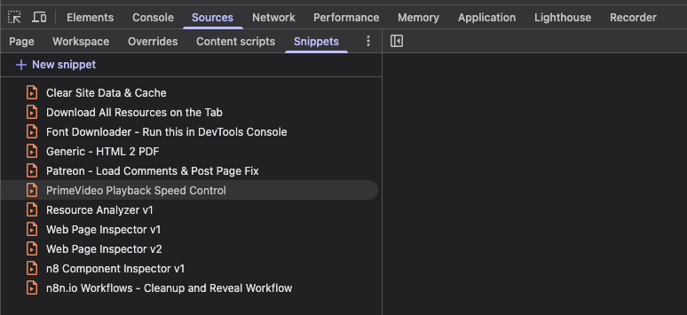

# DevTools Snippets

A collection of Chrome/Brave DevTools console snippets for web development, debugging, and page manipulation.

## Snippets

Only the latest version of each snippet is listed below. Superseded versions and the research/probe scripts that informed them are kept in [`archive/`](archive/README.md) — see the archive index for their descriptions.

### General Purpose

| Snippet                               | Description                                                                                                                                                                                                                                                                                                                                                                                                                                                           |
| ------------------------------------- | --------------------------------------------------------------------------------------------------------------------------------------------------------------------------------------------------------------------------------------------------------------------------------------------------------------------------------------------------------------------------------------------------------------------------------------------------------------------- |
| **Batch URL Downloader**              | Modal UI for batch-downloading a list of URLs (one per line) via `fetch` -> blob -> `<a download>`. **Inspect** probes status, size, and resolved filename for the first URL; **Test** checks reachability for all; **Download** saves each, resolving filenames from `Content-Disposition` or content-type. Includes dedupe/sort, adjustable delay, new-tab fallback when a direct fetch is blocked, and a per-origin download history to skip already-fetched URLs. |
| **Clear Site Data & Cache**           | Opens Brave's clear-browsing-data settings and optionally hard-reloads the page afterward.                                                                                                                                                                                                                                                                                                                                                                            |
| **Download All Resources on the Tab** | Finds all `img`, `link`, `script`, `source`, and `iframe` elements on the page and triggers a download for each resource URL.                                                                                                                                                                                                                                                                                                                                         |
| **Font Downloader**                   | Fetches a Google Fonts CSS URL, extracts the font-file URLs, and prints ready-to-run `wget` and `curl` commands. Edit the `fontCssUrl` variable to target different fonts.                                                                                                                                                                                                                                                                                            |
| **Generic - HTML 2 PDF**              | Converts the current page (or `#main-content` if present) to a PDF using [html2pdf.js](https://github.com/eKoopmans/html2pdf.js), with a date-stamped filename.                                                                                                                                                                                                                                                                                                       |
| **Resource Analyzer v1**              | Analyzes page resources (CSS, JS, fonts, images, SVGs, API calls) via the Performance API and DOM, then prints a grouped report in the console.                                                                                                                                                                                                                                                                                                                       |
| **Web Page Inspector v2**             | Comprehensive page analysis covering DOM structure, framework detection (React, Vue, Angular, Next.js, Nuxt, jQuery, Tailwind, etc.), web components, Shadow DOM, security headers, performance metrics, accessibility, and more. Results can be exported as JSON or HTML.                                                                                                                                                                                            |

### Site-Specific

| Snippet                                                     | Target Site      | Description                                                                                                                                                                                                                                                                                                                                                                                                                                                                                                                                                                                                                                                                                               |
| ----------------------------------------------------------- | ---------------- | --------------------------------------------------------------------------------------------------------------------------------------------------------------------------------------------------------------------------------------------------------------------------------------------------------------------------------------------------------------------------------------------------------------------------------------------------------------------------------------------------------------------------------------------------------------------------------------------------------------------------------------------------------------------------------------------------------- |
| **n8 Component Inspector v1**                               | n8n.io           | Inspects the `n8n-demo` custom element and its Shadow DOM. Uses MutationObservers to monitor attribute and child changes, auto-stopping after 30 seconds.                                                                                                                                                                                                                                                                                                                                                                                                                                                                                                                                                 |
| **n8n.io Workflows - Cleanup and Reveal Workflow**          | n8n.io           | Makes embedded n8n workflows full-screen and interactive by removing overlays, headers, footers, and surrounding layout chrome. Survives SPA navigation.                                                                                                                                                                                                                                                                                                                                                                                                                                                                                                                                                  |
| **Patreon - Load Comments & Post Page Fix**                 | Patreon          | Recursively loads all comments and replies, adjusts layout for readability, replaces YouTube embeds with thumbnails (CORS workaround), and generates a downloadable PDF of the post.                                                                                                                                                                                                                                                                                                                                                                                                                                                                                                                      |
| **PrimeVideo Playback Speed Control**                       | Prime Video      | Adds keyboard shortcuts (**D** = faster, **S** = slower) and a console helper `ss(rate)` to control video playback speed from 0.1x to 16x. Displays a brief on-screen overlay when the speed changes.                                                                                                                                                                                                                                                                                                                                                                                                                                                                                                     |
| **Claude.ai Chat Exporter - Transcript + Attachments v8.6** | Claude.ai        | Latest version. Self-contained rewrite with zero external dependencies: ships an inline ZIP writer (no JSZip CDN, works under Claude's CSP). Uses the internal conversation API as the primary content source with an auto-scroll DOM harvest fallback, exports only the active branch of edited chats, folds create/rewrite/update tool calls into final artifacts, downloads original uploads and images, and produces `transcript.md`, `artifacts/`, `images/`, `manifest.json`, and a rich self-contained `conversation.html` viewer (collapsible per-turn sections, per-block Copy-as-Markdown, width/font toggles, and a sticky toolbar with a live turn-position pill and per-turn elapsed times). |
| **Google AI Studio - Chat Exporter (base64 attachments)**   | Google AI Studio | Exports a chat conversation to Markdown and/or JSON with per-turn scrolling for virtual scroll, thinking/reasoning blocks, and system instructions. Base64 images are kept inline.                                                                                                                                                                                                                                                                                                                                                                                                                                                                                                                        |
| **Google AI Studio - Chat Exporter (separate attachments)** | Google AI Studio | Exports a chat conversation to Markdown and/or JSON. Extracts embedded base64 images as separate downloadable files and references them by filename in the export.                                                                                                                                                                                                                                                                                                                                                                                                                                                                                                                                        |
| **Google AI Studio - Library Page Exporter**                | Google AI Studio | Exports all prompts/chats from the Library page to JSON, CSV, and/or Markdown. Scrolls the virtualized table to capture every entry.                                                                                                                                                                                                                                                                                                                                                                                                                                                                                                                                                                      |
| **YouTube Playback Speed Control v2**                       | YouTube          | Keyboard shortcuts (`Shift+>` / `Shift+<`) and a console helper `ss(rate)` control video playback speed beyond YouTube's 2x cap, plus brightness control via `a` / `s` and a `sb(level)` helper that adjusts a darkening overlay. Speed and brightness state are tracked independently, with a brief overlay shown on change.                                                                                                                                                                                                                                                                                                                                                                             |

## How to Use

### Option 1 -- DevTools Snippets Panel (recommended)

1. Open DevTools (`F12` or `Cmd+Opt+I` / `Ctrl+Shift+I`).
2. Go to **Sources** > **Snippets** (you may need to click the `>>` chevron to reveal the tab).
3. Click **+ New snippet**, give it a name, and paste the code.
4. Right-click the snippet and select **Run**, or press `Cmd+Enter` / `Ctrl+Enter`.

Snippets saved this way persist across browser sessions.

### Option 2 -- Console

1. Open DevTools and switch to the **Console** tab.
2. Paste the snippet code and press `Enter`.

## License

[MIT](LICENSE) -- CaptainCodeAU
